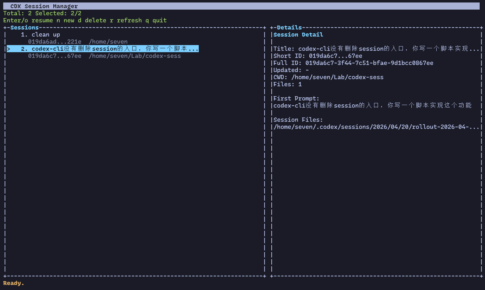

# cdx-session-manager

A lightweight Codex session manager:
- interactive TUI session list
- open selected session in tmux tab
- create new session for a target directory
- delete session(s)

轻量级 Codex 会话管理器：
- 交互式 TUI 会话列表
- 将选中会话打开到 tmux tab
- 在指定目录新建会话
- 删除会话

## Screenshot / 界面截图



## Why this exists / 为什么要做这个

Codex's built-in conversation management still has room for improvement: scattered entry points, no direct deletion workflow, and friction when switching projects.  
This tool provides one practical, keyboard-first control surface for day-to-day session operations.

Codex 原生对话管理在日常使用中还有不少可改进空间：会话入口分散、删除能力缺失、跨项目切换成本高，定位旧会话效率也不稳定。  
这个工具把这些高频操作收敛成统一入口，尽量减少在“找会话”和“管理上下文”上的时间消耗。

## Install

Dependency:

- `tmux` (recommended and used for in-terminal tab workflow)
- `prompt_toolkit` (optional, for third-party TUI backend via `--ui ptk`)

One command (after clone):

```bash
./scripts/install.sh
```

Remote one-liner:

```bash
bash -c "$(curl -fsSL https://raw.githubusercontent.com/sevetis/codex-session-manager/main/scripts/install.sh)"
```

Manual setup (fallback):

```bash
chmod +x codex_session_manager.py
cat > ~/bin/cdx <<'SH'
#!/usr/bin/env bash
set -euo pipefail
exec /path/to/codex-session-manager/codex_session_manager.py "$@"
SH
chmod +x ~/bin/cdx
```

For fish:

```fish
fish_add_path -m $HOME/bin
```

fish 用户可将上面一行写入 `~/.config/fish/config.fish` 持久生效。

## Usage

```bash
cdx
cdx --ui ptk
cdx --list
cdx /path/to/project "start a refactor"
```

```bash
# 仅打开管理器（TUI）
cdx

# 使用 prompt_toolkit 后端（实验）
cdx --ui ptk

# 列出会话
cdx --list

# 在指定目录新建会话（可选首条 prompt）
cdx /path/to/project "start a refactor"
```

### tmux workflow

- Running `cdx` (no args) auto-hosts into tmux session `cdx` when available.
- Opening a session (`Enter` / `o`) creates and switches to a new tmux window (tab-like).
- Use `[` and `]` to switch between tabs (works inside cdx and inside codex sessions).

### tmux 工作流

- 直接运行 `cdx`（无参数）时，若系统有 tmux，会自动托管到名为 `cdx` 的 tmux 会话。
- 在列表里按 `Enter` / `o` 会打开并切换到新的 tmux window（类似 tab）。
- 用 `[` 和 `]` 在 tab 间切换（在 cdx 和 codex 会话内都可用）。

## TUI keys

- `j/k` or `Up/Down`: move
- `Enter` or `o`: open selected session tab and switch to it
- `[` / `]`: switch tmux tabs
- `n`: create a new session
- `d`: delete selected session
- `v`: switch view mode (time / grouped by cwd)
- `r`: refresh
- `q`: quit

## TUI 快捷键

- `j/k` 或 `上/下`: 移动选中
- `Enter` 或 `o`: 打开选中会话 tab 并切换过去
- `[` / `]`: 切换 tmux tab
- `n`: 新建会话
- `d`: 删除会话
- `v`: 切换视图（按时间 / 按目录分组）
- `r`: 刷新
- `q`: 退出
